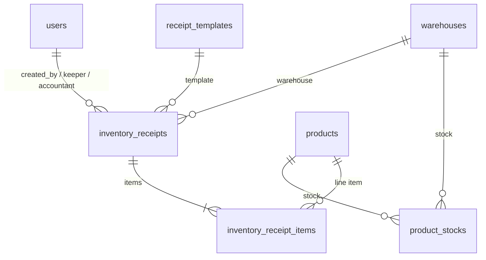

# Inventory Management

Ứng dụng quản lý kho (Flutter), dùng **Supabase** làm backend và **Firebase + Google Sign-In** để đăng nhập.

Tài liệu này hướng dẫn: cài đặt, schema database, khởi động app, và chạy unit test (đặc biệt phần tạo phiếu nhập kho).

---

## Yêu cầu hệ thống

| Công cụ | Phiên bản gợi ý |
|---------|------------------|
| [Flutter SDK](https://docs.flutter.dev/get-started/install/windows) | 3.9+ (khớp `pubspec.yaml`) |
| Git | Bất kỳ bản ổn định |
| Trình duyệt Chrome | Dùng khi chạy `flutter run -d chrome` |
| Tài khoản Supabase | URL + Anon Key cho project |
| Firebase project | Đã cấu hình Google Sign-In (file `lib/firebase_options.dart` có sẵn trong repo) |

Kiểm tra môi trường:

```powershell
flutter doctor
```


---

## Cài đặt lần đầu

### 1. Clone và vào thư mục project

```powershell
cd c:\inventory_management_test\inventory_management
```

### 2. Cài dependency

```powershell
flutter pub get
```

### 3. Tạo file cấu hình `.env`

File `.env` **không** được commit (nằm trong `.gitignore`). Tạo từ mẫu:

```powershell
copy .env.example .env
```

Mở `.env` và điền thông tin Supabase (lấy từ Supabase Dashboard → **Project Settings** → **API**):

```env
APP_MODE=supabase
SUPABASE_URL=https://xxxxxxxx.supabase.co
SUPABASE_ANON_KEY=eyJhbGciOiJIUzI1NiIsInR5cCI6IkpXVCJ9...
```

### 4. (Tùy chọn) Sinh lại file đa ngôn ngữ

Khi sửa file trong `lib/l10n/*.arb`:

```powershell
flutter gen-l10n
```

### 5. Tạo schema database trên Supabase

1. Mở [Supabase Dashboard](https://supabase.com/dashboard) → chọn project → **SQL Editor**
2. Dán và chạy toàn bộ script trong mục [Schema database](#schema-database-postgresql--supabase) bên dưới
3. Kiểm tra các bảng đã xuất hiện trong **Table Editor**

---

## Schema database (PostgreSQL / Supabase)

Database dùng **PostgreSQL** trên Supabase. Extension `pgcrypto` cung cấp hàm `gen_random_uuid()` để tự sinh khóa chính dạng UUID.

### Sơ đồ quan hệ (tóm tắt)



### Script khởi tạo

Chạy một lần trên Supabase SQL Editor:

```sql
CREATE EXTENSION IF NOT EXISTS "pgcrypto";

-- =========================================
-- USERS
-- =========================================
CREATE TABLE users (
    id UUID PRIMARY KEY DEFAULT gen_random_uuid(),

    full_name VARCHAR(255) NOT NULL,
    phone_number VARCHAR(20),
    email VARCHAR(255) UNIQUE NOT NULL,
    avatar_url TEXT,

    role VARCHAR(50) NOT NULL,

    created_at TIMESTAMPTZ DEFAULT NOW()
);

-- =========================================
-- RECEIPT TEMPLATES
-- =========================================
CREATE TABLE receipt_templates (
    id UUID PRIMARY KEY DEFAULT gen_random_uuid(),

    code VARCHAR(50) NOT NULL,
    name VARCHAR(255) NOT NULL,
    description TEXT,

    created_at TIMESTAMPTZ DEFAULT NOW()
);

-- =========================================
-- WAREHOUSES
-- =========================================
CREATE TABLE warehouses (
    id UUID PRIMARY KEY DEFAULT gen_random_uuid(),

    code VARCHAR(50) UNIQUE NOT NULL,
    name VARCHAR(255) NOT NULL,
    location TEXT,

    created_at TIMESTAMPTZ DEFAULT NOW()
);

-- =========================================
-- PRODUCTS
-- =========================================
CREATE TABLE products (
    id UUID PRIMARY KEY DEFAULT gen_random_uuid(),

    sku VARCHAR(50) UNIQUE NOT NULL,
    name VARCHAR(255) NOT NULL,
    unit VARCHAR(50) NOT NULL,
    description TEXT,

    created_at TIMESTAMPTZ DEFAULT NOW()
);

-- =========================================
-- PRODUCT STOCKS
-- =========================================
CREATE TABLE product_stocks (
    id UUID PRIMARY KEY DEFAULT gen_random_uuid(),

    product_id UUID NOT NULL
        REFERENCES products(id)
        ON DELETE CASCADE,

    warehouse_id UUID NOT NULL
        REFERENCES warehouses(id)
        ON DELETE CASCADE,

    quantity DECIMAL(18,2) DEFAULT 0,

    updated_at TIMESTAMPTZ DEFAULT NOW()
);

-- =========================================
-- INVENTORY RECEIPTS
-- =========================================
CREATE TABLE inventory_receipts (
    id UUID PRIMARY KEY DEFAULT gen_random_uuid(),

    receipt_template_id UUID
        REFERENCES receipt_templates(id),

    receipt_number VARCHAR(100) UNIQUE NOT NULL,

    receipt_date DATE NOT NULL,

    debit_account VARCHAR(50),
    credit_account VARCHAR(50),

    delivered_by VARCHAR(255),

    reference_number VARCHAR(100),
    reference_date DATE,

    reference_type VARCHAR(255),

    supplier_name VARCHAR(255),

    warehouse_id UUID
        REFERENCES warehouses(id),

    company_name VARCHAR(255),
    department_name VARCHAR(255),

    location TEXT,

    total_amount DECIMAL(18,2) DEFAULT 0,

    attached_documents_count INT DEFAULT 0,

    note TEXT,

    created_by_user_id UUID
        REFERENCES users(id),

    warehouse_keeper_user_id UUID
        REFERENCES users(id),

    chief_accountant_user_id UUID
        REFERENCES users(id),

    signed_at TIMESTAMPTZ,

    created_signature_url TEXT,
    keeper_signature_url TEXT,
    accountant_signature_url TEXT,

    created_at TIMESTAMPTZ DEFAULT NOW()
);

-- =========================================
-- INVENTORY RECEIPT ITEMS
-- =========================================
CREATE TABLE inventory_receipt_items (
    id UUID PRIMARY KEY DEFAULT gen_random_uuid(),

    receipt_id UUID NOT NULL
        REFERENCES inventory_receipts(id)
        ON DELETE CASCADE,

    order_index INT NOT NULL,

    product_id UUID
        REFERENCES products(id),

    quantity_document DECIMAL(18,2) DEFAULT 0,

    quantity_received DECIMAL(18,2) DEFAULT 0,

    unit_price DECIMAL(18,2) DEFAULT 0,

    total_price DECIMAL(18,2) DEFAULT 0
);
```

---

### Bảng `users` — Người dùng hệ thống

Lưu tài khoản nội bộ (khác với user đăng nhập Firebase/Google; có thể đồng bộ sau).

| Cột | Kiểu | Giải thích |
|-----|------|------------|
| `id` | UUID | Khóa chính, tự sinh |
| `full_name` | VARCHAR(255) | Họ tên hiển thị |
| `phone_number` | VARCHAR(20) | Số điện thoại (tùy chọn) |
| `email` | VARCHAR(255) | Email, **duy nhất** trong hệ thống |
| `avatar_url` | TEXT | URL ảnh đại diện |
| `role` | VARCHAR(50) | Vai trò: admin, thủ kho, kế toán… |
| `created_at` | TIMESTAMPTZ | Thời điểm tạo bản ghi |

---

### Bảng `receipt_templates` — Mẫu phiếu

Danh mục loại phiếu (ví dụ: phiếu nhập kho mẫu C45…).

| Cột | Kiểu | Giải thích |
|-----|------|------------|
| `id` | UUID | Khóa chính |
| `code` | VARCHAR(50) | Mã mẫu phiếu |
| `name` | VARCHAR(255) | Tên mẫu |
| `description` | TEXT | Mô tả thêm |
| `created_at` | TIMESTAMPTZ | Ngày tạo |

> App hiện **chưa** gán `receipt_template_id` khi tạo phiếu; cột dùng cho mở rộng sau.

---

### Bảng `warehouses` — Kho

| Cột | Kiểu | Giải thích |
|-----|------|------------|
| `id` | UUID | Khóa chính |
| `code` | VARCHAR(50) | Mã kho, **duy nhất** (app tự sinh dạng `WH_TEN_KHO` nếu tạo mới) |
| `name` | VARCHAR(255) | Tên kho (form “Kho”) |
| `location` | TEXT | Địa điểm kho (form “Địa điểm”) |
| `created_at` | TIMESTAMPTZ | Ngày tạo |

**App:** Khi lưu phiếu, tìm kho theo `name`; nếu chưa có thì `insert` bản ghi mới (`receipt_supabase_datasource.dart`).

---

### Bảng `products` — Sản phẩm

| Cột | Kiểu | Giải thích |
|-----|------|------------|
| `id` | UUID | Khóa chính |
| `sku` | VARCHAR(50) | Mã hàng (SKU), **duy nhất** |
| `name` | VARCHAR(255) | Tên sản phẩm |
| `unit` | VARCHAR(50) | Đơn vị tính (Cái, Kg…) |
| `description` | TEXT | Mô tả (tùy chọn) |
| `created_at` | TIMESTAMPTZ | Ngày tạo |

**App:** Tìm theo `sku` nếu user nhập mã; không có SKU thì tạo mới với mã tự sinh `SP_...`.

---

### Bảng `product_stocks` — Tồn kho theo kho

Số lượng từng sản phẩm tại từng kho (chưa cập nhật tự động khi tạo phiếu trong code hiện tại).

| Cột | Kiểu | Giải thích |
|-----|------|------------|
| `id` | UUID | Khóa chính |
| `product_id` | UUID | FK → `products.id`, xóa SP thì xóa tồn |
| `warehouse_id` | UUID | FK → `warehouses.id` |
| `quantity` | DECIMAL(18,2) | Số lượng tồn |
| `updated_at` | TIMESTAMPTZ | Lần cập nhật gần nhất |

---

### Bảng `inventory_receipts` — Phiếu nhập kho (header)

Thông tin chung của một phiếu.

| Cột | Kiểu | Giải thích |
|-----|------|------------|
| `id` | UUID | Khóa chính, app nhận sau khi `insert` |
| `receipt_template_id` | UUID | FK → mẫu phiếu (tùy chọn) |
| `receipt_number` | VARCHAR(100) | **Số phiếu**, bắt buộc, duy nhất |
| `receipt_date` | DATE | **Ngày lập phiếu** |
| `debit_account` | VARCHAR(50) | Tài khoản Nợ (kế toán) |
| `credit_account` | VARCHAR(50) | Tài khoản Có |
| `delivered_by` | VARCHAR(255) | **Người giao hàng** |
| `reference_number` | VARCHAR(100) | Số chứng từ gốc (hóa đơn, BB…) |
| `reference_date` | DATE | Ngày chứng từ gốc |
| `reference_type` | VARCHAR(255) | Loại chứng từ gốc |
| `supplier_name` | VARCHAR(255) | Tên nhà cung cấp |
| `warehouse_id` | UUID | FK → kho nhập |
| `company_name` | VARCHAR(255) | Tên đơn vị (header phiếu) |
| `department_name` | VARCHAR(255) | Bộ phận |
| `location` | TEXT | Địa điểm (trên phiếu, có thể trùng ý với kho) |
| `total_amount` | DECIMAL(18,2) | **Tổng tiền** các dòng hàng |
| `attached_documents_count` | INT | Số chứng từ kèm theo |
| `note` | TEXT | Ghi chú; **app hiện lưu JSON tên người ký** (xem bên dưới) |
| `created_by_user_id` | UUID | FK → user người lập (schema; app chưa gán) |
| `warehouse_keeper_user_id` | UUID | FK → thủ kho |
| `chief_accountant_user_id` | UUID | FK → kế toán trưởng |
| `signed_at` | TIMESTAMPTZ | Ngày ký (app gửi dạng ngày `yyyy-MM-dd`) |
| `created_signature_url` | TEXT | URL ảnh chữ ký người lập |
| `keeper_signature_url` | TEXT | URL chữ ký thủ kho |
| `accountant_signature_url` | TEXT | URL chữ ký kế toán trưởng |
| `created_at` | TIMESTAMPTZ | Thời điểm tạo bản ghi trên hệ thống |

**Cột `note` khi tạo phiếu từ app** — JSON dạng:

```json
{
  "signatures": {
    "created_by_name": "Tên người lập",
    "warehouse_keeper_name": "Tên thủ kho",
    "chief_accountant_name": "Tên kế toán trưởng"
  }
}
```

Tên trên form được map vào `note`, **chưa** ghi vào `*_user_id` hay `*_signature_url` (dự phòng cho bản sau).

---

### Bảng `inventory_receipt_items` — Chi tiết từng dòng hàng

| Cột | Kiểu | Giải thích |
|-----|------|------------|
| `id` | UUID | Khóa chính dòng |
| `receipt_id` | UUID | FK → phiếu cha; xóa phiếu thì xóa hết dòng |
| `order_index` | INT | **Thứ tự dòng** trên phiếu (1, 2, 3…) |
| `product_id` | UUID | FK → sản phẩm |
| `quantity_document` | DECIMAL(18,2) | Số lượng theo chứng từ |
| `quantity_received` | DECIMAL(18,2) | Số lượng thực nhập |
| `unit_price` | DECIMAL(18,2) | Đơn giá |
| `total_price` | DECIMAL(18,2) | Thành tiền (= SL thực nhập × đơn giá trên form) |

**App:** Mỗi dòng form có tên hàng → tạo/tìm `products` → `insert` một bản ghi vào bảng này.

---

### Ánh xạ form “Tạo phiếu” → database

| Trên form (app) | Bảng.cột |
|-----------------|----------|
| Số phiếu | `inventory_receipts.receipt_number` |
| Ngày lập | `inventory_receipts.receipt_date` |
| TK Nợ / Có | `debit_account`, `credit_account` |
| Người giao | `delivered_by` |
| Loại / Số / Ngày CT gốc | `reference_type`, `reference_number`, `reference_date` |
| Nhà cung cấp | `supplier_name` |
| Kho / Địa điểm | `warehouses` (+ `warehouse_id`, `location` trên phiếu) |
| Công ty / Bộ phận | `company_name`, `department_name` |
| Tổng tiền | `total_amount` |
| Số CT kèm theo | `attached_documents_count` |
| Ngày ký | `signed_at` |
| Người lập / Thủ kho / Kế toán trưởng (tên) | `note` (JSON) |
| Tên / Mã / ĐVT / SL / Đơn giá / Thành tiền | `inventory_receipt_items` + `products` |

---

## Chạy chương trình

### Chạy trên Chrome (khuyến nghị khi phát triển web)

```powershell
flutter run -d chrome
```

### Chạy trên Windows desktop

```powershell
flutter run -d windows
```

### Xem danh sách thiết bị có sẵn

```powershell
flutter devices
```

### Chế độ release (build nhanh hơn, không hot reload)

```powershell
flutter run -d chrome --release
```

### Luồng sử dụng cơ bản trong app

1. Mở app → trang **Đăng nhập** (`/`)
2. Đăng nhập bằng **Google** (cần Firebase + Google Sign-In đã cấu hình đúng)
3. Vào mục **Receipts** (phiếu nhập) → tạo / xem phiếu

> **Lưu ý:** Nếu app báo lỗi khi khởi động, kiểm tra `.env` (URL/Key Supabase) và cấu hình Firebase. Lỗi `Unable to load asset: .env` nghĩa là thiếu file `.env` ở thư mục gốc project.

---

## Chạy unit test

Unit test kiểm tra **logic code** (không mở UI, không cần đăng nhập, không ghi database thật cho các test tạo phiếu).

### Chạy toàn bộ test trong project

```powershell
flutter test
```

### Chỉ chạy test liên quan phiếu nhập (create receipt)

```powershell
flutter test test/features/receipts/
```

### Chạy từng file

```powershell
flutter test test/features/receipts/data/helpers/receipt_create_helpers_test.dart
flutter test test/features/receipts/data/mappers/receipt_create_form_mapper_test.dart
flutter test test/features/receipts/data/datasources/receipt_supabase_datasource_create_test.dart
```

### Chạy trong Cursor / VS Code

1. Mở file `*_test.dart`
2. Bấm **Run** / **Debug** cạnh `void main()` hoặc cạnh từng `test('...')`
3. Hoặc dùng extension **Flutter** → **Flutter: Run All Tests**

### Đọc kết quả

| Kết quả | Ý nghĩa |
|---------|---------|
| `All tests passed!` | Mọi test đều đúng |
| `Expected: ... Actual: ...` | Có test fail — code hoặc test cần sửa |

---

## Các file test create receipt làm gì?

| File | Kiểm tra |
|------|----------|
| `test/.../receipt_create_helpers_test.dart` | Format ngày, JSON chữ ký, mã kho/SP, payload gửi DB |
| `test/.../receipt_create_form_mapper_test.dart` | Validation form (thiếu số phiếu, ngày sai, dòng hàng trống…) |
| `test/.../receipt_supabase_datasource_create_test.dart` | Luồng `createReceipt`: gắn kho, sản phẩm, tạo dòng hàng (dùng dữ liệu giả, không gọi Supabase thật) |

Code nguồn tương ứng:

| Test | Code app |
|------|----------|
| Form mapper | `lib/features/receipts/data/mappers/receipt_create_form_mapper.dart` |
| Helpers | `lib/features/receipts/data/helpers/receipt_create_helpers.dart` |
| Datasource | `lib/features/receipts/data/datasources/receipt_supabase_datasource.dart` |

---

## Cấu trúc thư mục chính

```text
lib/
  main.dart                 # Khởi tạo Supabase, Firebase, chạy app
  app/                      # Router, theme
  core/                     # Config, database
  features/
    auth/                   # Đăng nhập Google
    receipts/               # Phiếu nhập kho (list, tạo, chi tiết)
    products/               # Sản phẩm
    ...
test/
  features/receipts/        # Unit test tạo phiếu
.env.example                # Mẫu biến môi trường
```

---

## Xử lý sự cố thường gặp

### `flutter` is not recognized

- Cài Flutter SDK và thêm `flutter\bin` vào **PATH**
- Đóng và mở lại terminal / Cursor

### `Unable to load asset: .env`

- Tạo file `.env` từ `.env.example` tại thư mục gốc `inventory_management/`
- Chạy lại `flutter pub get` rồi `flutter run`

### Đăng nhập Google thất bại

- Kiểm tra Firebase project và `firebase_options.dart`
- Trên web: cấu hình OAuth client và authorized domains trong Google Cloud Console

### Supabase lỗi khi lưu phiếu

- Kiểm tra `SUPABASE_URL` và `SUPABASE_ANON_KEY` trong `.env`
- Chạy script [Schema database](#schema-database-postgresql--supabase) trên Supabase SQL Editor
- Kiểm tra RLS (Row Level Security): nếu bật policy chặn `insert`, cần thêm policy cho role `anon` / `authenticated`

### Test fail sau khi sửa code

- Chạy lại: `flutter test test/features/receipts/`
- Đọc dòng `Expected` / `Actual` trong log để biết giá trị nào sai

---

## Lệnh hữu ích khác

```powershell
# Phân tích / cảnh báo code
flutter analyze

# Build web
flutter build web

# Dọn build cache (khi gặp lỗi build lạ)
flutter clean
flutter pub get
```

---

## Tài liệu tham khảo

- [Flutter – Get started (Windows)](https://docs.flutter.dev/get-started/install/windows)
- [Flutter – Testing](https://docs.flutter.dev/testing)
- [Supabase Flutter](https://supabase.com/docs/reference/dart/introduction)
